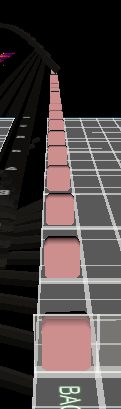
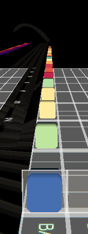
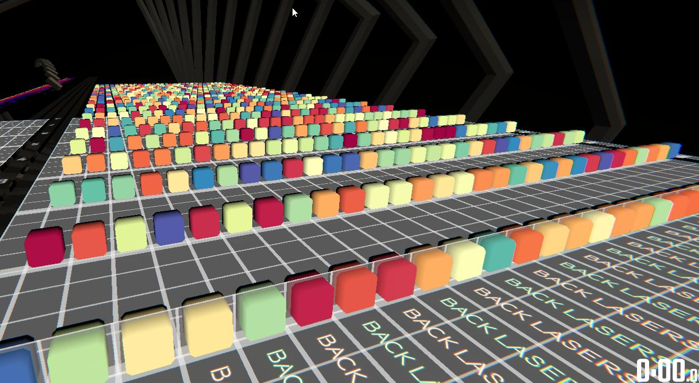
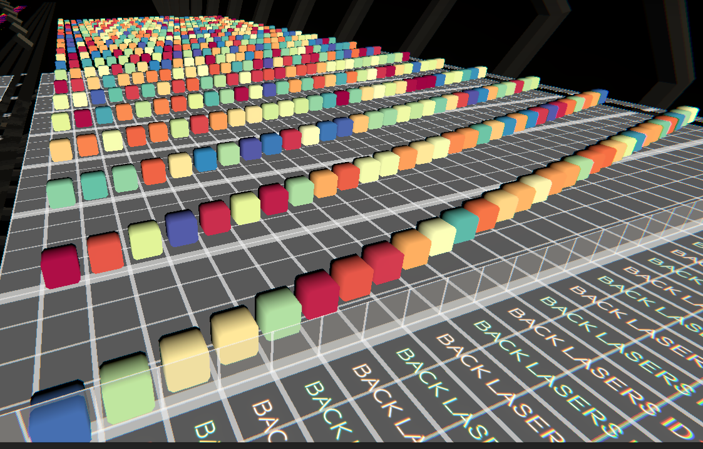
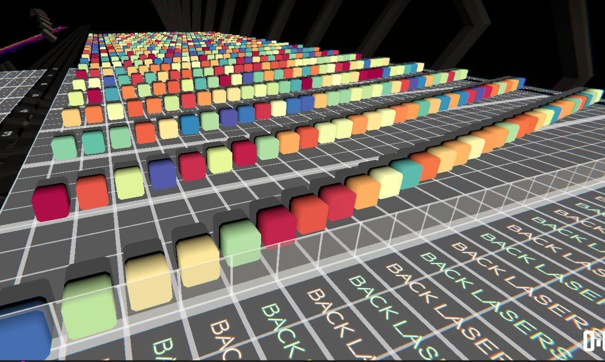
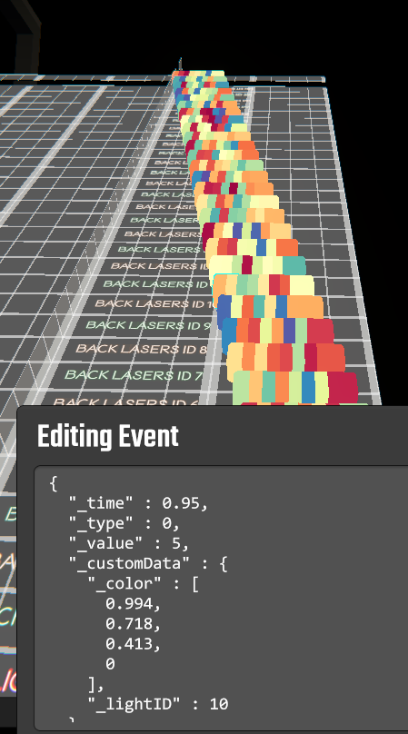
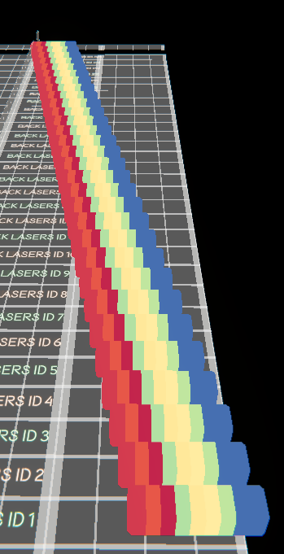
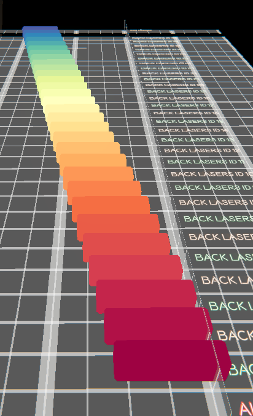
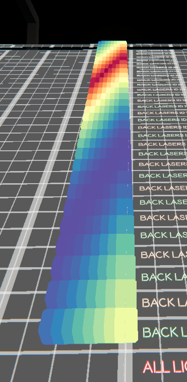

# Ilysa

Ilysa is a Go library that helps you create your favorite lighting patterns with speed and ease (probably)!

## Sell Me

[Too Many Words, Gif Video Pls](#too-many-words-not-convinced-video-pls)

Lazy lighter: I wanna place a back lasers red fade block every beat for 50 beats!

<details>
<summary>See the Ilysa code</summary>

```go
p.EventsForBeats(0, 1, 50, func(ctx ilysa.TimeContext) { // startBeat 0, beat length 1, repeat 50 times
    ctx.NewLightingEvent(
        ilysa.WithType(beatsaber.EventTypeBackLasers),
        ilysa.WithValue(beatsaber.EventValueLightRedFade),
    )
})
```

</details>

<details>
<summary>ChroMapper Preview</summary>



</details>

Lazy lighter: Well, that's not as exciting as I thought. I heard Chroma lights gives upvotes! I want gamer lights! Make
every fade a different color!

<details>
<summary>See the Ilysa code</summary>

```go
p.EventsForBeats(0, 1, 50, func(ctx ilysa.TimeContext) {
    ctx.NewRGBLightingEvent(  // make it Chroma
        ilysa.WithType(beatsaber.EventTypeBackLasers),
        ilysa.WithValue(beatsaber.EventValueLightRedFade),
        ilysa.WithColor(gradient.Rainbow.Ierp(ctx.FixedRand())), // add Rainbow power
    )
})
```

</details>

<details>
<summary>ChroMapper Preview</summary>



</details>

Lazy lighter: OIC. That's still boring. What's that lightID thing those fancy lighters are using these days? Gimme
rainbow lightIDs!

<details>
<summary>See the Ilysa code</summary>

```go
// get an Ilysa light representing a base game back laser (i.e. only "1" lightID)
backLasers := ilysa.NewBasicLight(beatsaber.EventTypeBackLasers, p) 

// transform the light into a back laser light with 1 lightID for each lightID it has in the beatmap's environment
// i.e. make it work like ChroMapper in LightID mode
backLasersSplit := ilysa.TransformLight(backLasers,
    ilysa.ToLightTransformer(ilysa.DivideSingle), 
)

p.EventsForBeats(0, 1, 50, func(ctx ilysa.TimeContext) {
    ctx.WithLight(backLasersSplit, func(ctx ilysa.TimeLightContext) {
        ctx.NewRGBLightingEvent(
            ilysa.WithValue(beatsaber.EventValueLightRedFade),
            ilysa.WithColor(gradient.Rainbow.Ierp(rand.Float64())),
        )
    })
})
```

</details>

<details>
<summary>ChroMapper Preview</summary>



</details>

Lazy lighter: Ah... Now we getting somewhere. All the lightIDs turning on at the same time is boring, I wanna stagger
them!

<details>

<summary>See the Ilysa code</summary>

```go
// light creation code omitted for brevity
p.EventsForBeats(0, 1, 50, func(ctx ilysa.TimeContext) {
    ctx.WithLight(backLasersSplit, func(ctx ilysa.TimeLightContext) {
        e := ctx.NewRGBLightingEvent( // save the event we created to the variable e
            ilysa.WithValue(beatsaber.EventValueLightRedFade),
            ilysa.WithColor(gradient.Rainbow.Ierp(rand.Float64())),
        )
        // shift each event forward by 0.05 beats * ordinal number of the lightID
        // i.e. 1st lightID is shifted forward by 0 beats
        //      2nd lightID is shifted forward by 0.05 beats, etc
        e.ShiftBeat(float64(ctx.LightIDOrdinal()) * 0.05)
    })
})
```

</details>

<details>
<summary>ChroMapper Preview</summary>



</details>

Lazy lighter: Maybe add an off event so it twinkles real nice?

<details>

<summary>See the Ilysa code</summary>

```go
// light creation code omitted for brevity
p.EventsForBeats(0, 1, 50, func(ctx ilysa.TimeContext) {
    ctx.WithLight(backLasersSplit, func(ctx ilysa.TimeLightContext) {
        e := ctx.NewRGBLightingEvent(
            ilysa.WithValue(beatsaber.EventValueLightRedFade),
            ilysa.WithColor(gradient.Rainbow.Ierp(rand.Float64())),
        )
        e.ShiftBeat(float64(ctx.LightIDOrdinal()) * 0.05)

        oe := ctx.NewRGBLightingEvent( // create an off event
            ilysa.WithValue(beatsaber.EventValueLightOff),
        )
        oe.ShiftBeat(float64(ctx.LightIDOrdinal())*0.05 + 0.1) // shift it forward by an additional 0.1 beat
    })
})
```

</details>

<details>
<summary>ChroMapper Preview</summary>



</details>

Lazy lighter: Wait, what happened to my fade effect? Fade effects don't work with lightIDs!?

<details>
<summary>See the Ilysa code</summary>

```go
// light creation code omitted for brevity
p.EventsForBeats(0, 1, 1, func(ctx ilysa.TimeContext) {
    // for each beat, create events at regular intervals from beat to beat + 0.5 beats, for a total of 8 beats
    ctx.EventsForRange(ctx.T(), ctx.T()+0.5, 8, ease.Linear, func(ctx ilysa.TimeContext) {
        ctx.WithLight(backLasersSplit, func(ctx ilysa.TimeLightContext) {
            e := ctx.NewRGBLightingEvent(
                // ilysa.WithValue(beatsaber.EventValueLightRedFade), // we never needed this
                ilysa.WithColor(gradient.Rainbow.Ierp(rand.Float64())),
            )
            e.ShiftBeat(float64(ctx.LightIDOrdinal()) * 0.05)
            e.SetAlpha(1 - ctx.T()) // linear alpha fade to 0
        })
    })
})
```

</details>

<details>
<summary>ChroMapper Preview</summary>



</details>

Lazy lighter: WTF happened to my colors!

<details>
<summary>See the Ilysa code</summary>

```go
// light creation code omitted for brevity
p.EventsForBeats(0, 1, 4, func(ctx ilysa.TimeContext) {
    // for each beat, create events at regular intervals from beat to beat + 0.5 beats, for a total of 8 beats
    ctx.EventsForRange(ctx.T(), ctx.T()+0.5, 8, ease.Linear, func(ctx ilysa.TimeContext) {
        ctx.WithLight(backLasersSplit, func(ctx ilysa.TimeLightContext) {
            e := ctx.NewRGBLightingEvent(
                // ilysa.WithValue(beatsaber.EventValueLightRedFade), // we never needed this
                ilysa.WithColor(gradient.Rainbow.Ierp(rand.Float64())),
            )
            e.ShiftBeat(float64(ctx.LightIDOrdinal()) * 0.05)
            e.SetAlpha(1 - ctx.T()) // linear alpha fade to 0
        })
    })
})
```

</details>

<details>
<summary>ChroMapper Preview</summary>



</details>

Lazy lighter: That's... not quite what I'm looking for.

<details>
<summary>See the Ilysa code</summary>

```go
// light creation code omitted for brevity
p.EventsForBeats(0, 1, 1, func(ctx ilysa.TimeContext) {
    ctx.EventsForRange(ctx.T(), ctx.T()+0.5, 8, ease.Linear, func(ctx ilysa.TimeContext) {
        ctx.WithLight(backLasersSplit, func(ctx ilysa.TimeLightContext) {
            // the fx package contains a suite of building blocks you can use to build more complicated effects
            // the Gradient function generates events and colors them based on the gradient passed to it
            e := fx.Gradient(ctx, gradient.Rainbow)

            e.ShiftBeat(float64(ctx.LightIDOrdinal()) * 0.05)
            e.SetAlpha(1 - ctx.T())
        })
    })
})
```

</details>

<details>
<summary>ChroMapper Preview</summary>



</details>

Lazy lighter: Hm... Can we spice it up?

<details>
<summary>See the Ilysa code</summary>

```go
// light creation code omitted for brevity
p.EventsForBeats(0, 1, 1, func(ctx ilysa.TimeContext) {
    ctx.EventsForRange(ctx.T(), ctx.T()+0.5, 8, ease.Linear, func(ctx ilysa.TimeContext) {
        ctx.WithLight(backLasersSplit, func(ctx ilysa.TimeLightContext) {
            // ColorSweep is a more advanced Gradient that shifts the gradient's position with time
            // the 2nd argument (1.2 below) controls the speed at which the gradient "moves"
            e := fx.ColorSweep(ctx, 1.2, gradient.Rainbow)

            // we then use fx.Ripple to stagger the start time of each lightID
            fx.Ripple(ctx, e, 0.2)

            e.SetAlpha(1 - ctx.T())
        })
    })
})
```

</details>

<details>
<summary>ChroMapper Preview</summary>



</details>

Lazy Lighter: Perfect. Now ease out the alpha fade please!

<details>
<summary>See the Ilysa code</summary>

```go
// light creation code omitted for brevity
p.EventsForBeats(0, 1, 1, func(ctx ilysa.TimeContext) {
    ctx.EventsForRange(ctx.T(), ctx.T()+0.5, 8, ease.Linear, func(ctx ilysa.TimeContext) {
        ctx.WithLight(backLasersSplit, func(ctx ilysa.TimeLightContext) {
            e := fx.ColorSweep(ctx, 1.2, gradient.Rainbow)

            fx.Ripple(ctx, e, 0.2)

            // fx.AlphaBlend does what it says on the tin, it accepts in order:
            // startT, endT, startAlpha, endAlpha and a ease function
            fx.AlphaBlend(ctx, e, 0, 1, 1, 0, ease.OutCirc)
        })
    })
})
```

</details>

## Too Many Words, Not Convinced, Video Pls

[](https://www.youtube.com/watch?v=PUoUHLk8hiY)

* Same [code](examples/showcase/main.go) for all 5 environments
* Ilysa automatically adapts to the lightIDs available in the selected environment
* Documentating the effect took more time than building it

## Is Ilysa for me?

Advanced Beat Saber lighting knowledge and intermediate computer skills required.

Ilysa may be for you if:

- you are experienced with lighting, can't code, but want to get started with scripting lights; starting with Ilysa is
  probably easier than trying to cobble together code from scratch;
- you are already scripting lights, and want a little more structure or help with dealing with the more tedious parts;
  or
- you are experienced with lighting, can code and want to raise the bar; the author thinks there are interesting things
  that can be done to make doing good lighting easier - check out the `Light` interface.

Ilysa is not for you if:

- you have never placed a Chroma event in ChroMapper;
- `_eventType` and `_eventValue` don't mean anything to you; or
- a command prompt scares you.

## Ilysa ...

* may not give better results than handlighting, it only makes actualizing complicated effects easy;
* may not be easier than handlighting (the converse is probably true);
* is not an autolighter - results directly proportionate to user's skill;
* does not generate any other beatmap elements (for walls, you probably want
  spookyGh0st's [Beatwalls](https://github.com/spookyGh0st/beatwalls#readme])).

## Do I need to know Go? Programming?

Ilysa is designed to be somewhat usable by a non-programmer (actual results may vary). You can probably achieve basic
results by copy/pasting code and tweaking values.

If you want to achieve novel effects, you'll need at least a rudimentary understanding of Go.

If you can already program in another language, Go should be a snap. Take a stroll
through [A Tour of Go](https://tour.golang.org/welcome/1) and carry on.

If you have no programming experience, Go is an easy language to learn. Try
taking [A Tour of Go](https://tour.golang.org/welcome/1). If you can make it to the section on Methods, you should be
good to go.

# Getting Started

## Requirements

* a working Go environment
* a working Git installation
* a code editor (these instructions are tested with Visual Studio Code and Ilysa's author uses Goland)
* a beatmap with *all* requisite BPM blocks placed

### Go Environment

Follow the instructions at:

* [Download and install](https://golang.org/doc/install)
* [Tutorial: Get started with Go](https://golang.org/doc/tutorial/getting-started)

If successfully complete all the instructions
at [Tutorial: Get started with Go](https://golang.org/doc/tutorial/getting-started), you have a working Go environment.

### Git Installation

If you are on:

* Windows - download and install from https://git-scm.com/downloads
* macOS - run `git` from Terminal to start the installer
* Linux - you don't need me

### Code Editor

#### Visual Studio Code

Install the Go extension from the Extensions menu and follow its Quick Start instructions. Be sure to install the
command line tools when prompted to do so for code assistance support.

#### Goland

You know what you're doing.

#### Vim/Emacs

Ahahahahahahahahahahahahahahahahahahahahahahahahaha. You definitely know what you're doing.

#### Something Else

You really want something that provides code assistance via `gopls` or something similar. If you are unsure, please try
starting out with Visual Studio Code.

### Beatmap

Ilysa works in BPM adjusted beats, i.e. the beat numbers displayed in MMA2 or ChroMapper. If you do not place all the
required BPM blocks before starting, and add BPM blocks after writing Ilysa code, you will probably have to retime your
code.

# Walkthrough

**⚠️ Ilysa will replace all lighting events in the selected difficulty. Please dedicate a copy of your map for use with
Ilysa and make backups (you should be making backups regardless)!⚠️**

## Preliminaries

### Alpha Testers Only

Add your SSH key to GitHub. Instructions
[here](https://docs.github.com/en/github/authenticating-to-github/connecting-to-github-with-ssh/adding-a-new-ssh-key-to-your-github-account)
.

If you can clone the repo with the following command, your SSH key configuration is correct.

```
git clone github.com/shasderias/ilysa
```

Before following the instructions below, execute:

```
go env -w GOPRIVATE=github.com/shasderias/ilysa
git config --add --global url."git@github.com:".insteadOf https://github.com
```

After the alpha is over, execute `go env`, make sure the `set GOPRIVATE` line looks like so:

```
set GOPRIVATE=github.com/shasderias/ilysa
```

then reset your configuration back to the default state by executing:

```
go env -w GOPRIVATE=
```

### Regular Instructions Here

Create a new directory to hold your Ilysa project, then in that directory, execute the following commands:

Initialize the directory as the root of a Go project.

```
go mod init projectName
```

Download Ilysa.

```
go get -u github.com/shasderias/ilysa
```

## Boilerplate

New to Go? Create a file named `main.go` in your project directory and copy and paste the contents
of [examples/getting-started/main.go](examples/getting-started/main.go) into it.

Compile and run your code by executing:

```shell
go run .
```

This will remove all lighting events from your map and add all events generated by Ilysa to it. The boilerplate code
does not generate any events, so this will simply remove all existing events.

Experienced programmer? Ilysa does not impose any structure on you, use the example as a starting point and feel free to
organize your code any way you want.

## Your First Ilysa Event

Edit `main.go` and add the following lines after the line `// -- your code goes here --`

```go
// -- your code goes here --
p.EventForBeat(2, func(ctx ilysa.TimeContext) { // generate events for beat 2:
    ctx.NewLightingEvent( // generate a new base game (non-Chroma) lighting event
        ilysa.WithType(beatsaber.EventTypeBackLasers),   // back lasers
        ilysa.WithValue(beatsaber.EventValueLightRedOn), // red on
    )
})
```

Compile and run by executing `go run .` and open the map in your beatmap editor. You should see a single red on event
for back lasers at beat 2.

### Explain Pls!

Generally, you use Ilysa by:

1. defining a time sequence within which you want to create events, this can be a single beat (e.g. beat 2), a sequence
   of beats (e.g. beats 4, 5 and 5.5) or a range of beats (beats 4 to 6); and
2. telling Ilysa what events to create in that time sequence.

The value returned by `ilysa.New()` (`p` in the snippet above) represents an Ilysa project and is your entry point for
working with the library. `p` has several methods you can call to define a time sequence and `EventForBeat` is one of
them.

`EventForBeat` defines a time sequence containing a single beat. In the example above, we indicate we want to create
events for beat 2 by passing `2` as the 1st argument.

The 2nd argument is a callback function which you use to actually create events. In Ilysa, these functions usually only
have one argument, a context value - `ctx` in the example above. You call methods on this `ctx` value to generate the
events you want.

### So Much Typing, How Do I Know What To Type D:

The signature of the callback function changes based on the method you are using to define the time sequence. So let
your editor's code assistance help you out. In Visual Studio Code you can type `p.EventForBeat(2,`, hit `Ctrl-Space` and
the first auto-completion offered by your editor should be what you need.

### Okay, What About Events?

The method `ctx.NewLightingEvent` generates a base game lighting event. You define the properties of the event by
passing in arguments. In the example above:

* we pass in `ilysa.WithType(beatsaber.EventTypeBackLasers)` to create an event that controls the lights in the Back
  Lasers group; and
* we pass in `ilysa.WithValue(beatsaber.EventValueLightRedOn)` to create an event that changes the back laser lights to
  red and turns them on.

### What Events Can I Generate?

For generating base game events, `ctx` has the following methods:

```go
ctx.NewRotationEvent()
// accepts ilysa.WithValue() for controlling the hydraulics in the Interscope environment

ctx.NewZoomEvent()
// does not accept any arguments

ctx.NewRotationSpeedEvent()
// accepts:
// - ilysa.WithDirectionalLaser() for selecting which laser to control
// e.g. ilysa.WithDirectionalLaser(ilysa.LeftLaser)
// - ilysa.WithIntValue() for setting the rotation speed of the laser selected
// e.g. ilysa.WithIntValue(3)
```

See [examples/some-basic-examples](examples/some-basic-examples/main.go)  for a few more basic examples.

## How is This Better  Than Placing Event Blocks!?

```p```  has other methods that can be used to define time sequences. Let's take a look at
```EventsForBeats```:

```go
// generate events every quarter beat (0.25), starting at beat 3, do this a total of 16 times ...
// i.e. 3.00, 3.25, 3.50, 3.75, 4.00 ... 6.50, 6.75
p.EventsForBeats(3, 0.25, 16, func(ctx ilysa.TimeContext) {  
    // ... each time, generate a rotation speed event ...
    ctx.NewRotationSpeedEvent(
        // ... that controls the left laser's rotation speed
        ilysa.WithDirectionalLaser(ilysa.LeftLaser),
        // ctx.Ordinal() returns the iteration number, starting at 0
        // i.e. for beat 3.00, ctx.Ordinal is 0, for beat 3.25, ctx.Ordinal is 1
        // the following line will therefore increase the left laser's rotation speed from 0 to 15 over 3.75 beats
        ilysa.WithValue(beatsaber.EventValue(ctx.Ordinal())),
    )
})
```

Whenever you define a time sequence, you get a `ctx` value that contains all sorts of handy methods that return values
for varying events with time. Take a look:

```go
B() float64         // current beat
T() float64         // current time in the current sequence, on a 0-1 scale
Ordinal() int       // ordinal number of the current iteration, starting from 0
StartBeat() float64 // first beat of the current sequence
EndBeat() float64   // last beat of the current sequence
Duration() float64  // duration of the current sequence, in beats
First() bool        // true if this is the first iteration
Last() bool         // true if this is the last iteration
FixedRand() float64 // a number from 0-1, fixed for the current sequence, but different for every sequence
```

In the above example, we used `ctx.Ordinal()` to vary the left laser's rotation speed with time. With a little
creativity, you can vary all sorts of things with time, colors, events and even time itself.

### A Few More Ways to Define Time Sequences

To create events that recur at specific beats, `p` has the `EventsForSequence` method which accepts a sequence of beats
and creates events based on that sequence.

```go
// generate events on beats 0, 0.25, 0.75 and 1.25, starting from beat 4
// i.e. 4.00, 4.25, 4.75, 5.25
p.EventsForSequence(4, []float64{0, 0.25, 0.75, 1.25}, func(ctx ilysa.SequenceContext) {
    ctx.NewLightingEvent(
        ilysa.WithType(beatsaber.EventTypeRingLights),
        ilysa.WithValue(beatsaber.EventValueLightBlueFade),
    )
})
```

The above snippet creates fade events for the ring lights at beats 4.00, 4.25, 4.75 and 5.25.

## Next Steps

TODO

# Gimme cut and paste! I want to ...

## ... generate events ...

<details>
  <summary>... on a specific beat!</summary>
Use

```go
EventForBeat(beat float64, callback func(ctx TimeContext))
```

e.g. beat 24.5

```go
p.EventForBeat(24.5, func(ctx ilysa.TimeContext) {
  // use ctx to generate events here
})
```

</details>


<details>
  <summary>... at regular beats!</summary>

Use

```go
EventsForBeats(startBeat, duration float64, count int, callback func(ctx TimeContext))
```

e.g. beats 0, 4, 8, 12, 16

```go
p.EventsForBeats(0, 4, 5, func(ctx ilysa.TimeContext) {
  // use ctx to generate events here
})
```

</details>

<details>
  <summary>... whenever I want to!</summary>

Use

```go
EventsForSequence(startBeat float64, sequence []float64, callback func(ctx SequenceContext))
```

e.g. beats 2.0, 2.25, 2.75, 3.0, 3.75

```go
p.EventsForSequence(0, []float64{2,2.25,2.75,3.0,3.75}, func(ctx ilysa.SequenceContext) {
  // use ctx to generate events here
})
```

</details>

<details>
  <summary>..., lots of events (in a range)!</summary>

Use

```go
EventsForRange(startBeat, endBeat float64, steps int, easeFunc ease.Func, callback func(TimeContext))
```

e.g. beats 2.0, 2.1, 2.2 ... 3.0

```go
p.EventsForRange(2, 3, 11, ease.Linear, func(tc ilysa.TimeContext) {
   // use ctx to generate events here
})
```

</details>

## ... generate the base game event for ...

<details>
  <summary>... lights!</summary>

Use

```go
NewLightingEvent(opts ...BasicLightingEventOpt) *BasicLightingEvent 
```

e.g. beat 2, back lasers, blue flash

```go
p.EventForBeat(2, func(ctx ilysa.TimeContext) {
  ctx.NewLightingEvent(
    ilysa.WithType(beatsaber.EventTypeBackLasers),
    ilysa.WithValue(beatsaber.EventValueLightBlueFlash),
  )
})
```

</details>

<details>
  <summary>... ring spins!</summary>

Use

```go
NewLightingEvent(opts ...BasicLightingEventOpt) *BasicLightingEvent 
```

e.g. beat 2, spin

```go
p.EventForBeat(2, func(ctx ilysa.TimeContext) {
  ctx.NewRotationEvent()
}
```

e.g. beat 2, raise hydraulics, all cars

```go
p.EventForBeat(2, func(ctx ilysa.TimeContext) {
  ctx.NewRotationEvent(
    ilysa.WithType(beatsaber.EventTypeInterscopeRaiseHydraulics),
    ilysa.WithValue(1), // TODO: add Interscope environment enums
  )
}
```

</details>

<details>
  <summary>... ring zooms!</summary>

Use

```go
NewZoomEvent()
```

e.g. beat 2, zoom pls

```go
p.EventForBeat(2, func(ctx ilysa.TimeContext) {
  ctx.NewZoomEvent()
}
```

</details>

<details>
  <summary>... light rotation speed!</summary>

Use

```go
NewRotationSpeedEvent(opts ...RotationSpeedEventOpt) *RotationSpeedEvent
```

e.g. beat 2, left laser, zooooooooom

```go
p.EventForBeat(2, func(ctx ilysa.TimeContext) {
  ctx.NewRotationSpeedEvent(
    ilysa.WithDirectionalLaser(ilysa.LeftLaser), 
    ilysa.WithIntValue(50),
  )
}
```

</details>

## ... generate the Chroma event ...

<details>
  <summary>... RGB lights!</summary>

Use

```go
NewRGBLightingEvent(opts ...RGBLightingEventOpt) *RGBLightingEvent
```

e.g. fully loaded

```go
ctx.NewRGBLightingEvent(
    ilysa.WithType(beatsaber.EventTypeBackLasers),
    ilysa.WithValue(beatsaber.EventValueLightRedOn),
    ilysa.WithColor(colorful.MustParseHex("#123123")),
    ilysa.WithAlpha(0.3),
    ilysa.WithLightID(ilysa.NewLightID(1, 2, 3)),
)
```

</details>

<details>
  <summary>... precise laser!</summary>

Use

```go
NewPreciseRotationSpeedEvent(opts ...PreciseRotationSpeedEventOpt) *PreciseRotationSpeedEvent
```

e.g. fully loaded

```go
ctx.NewPreciseRotationSpeedEvent(
    ilysa.WithLockPosition(true),
    ilysa.WithIntValue(1),
    ilysa.WithSpeed(0),
    ilysa.WithDirection(chroma.Clockwise),
)
```

</details>

<details>
<summary>... precise rotation!</summary>

Use

```go
NewPreciseRotationEvent(opts ...PreciseRotationEventOpt) *PreciseRotationEvent 
```

e.g. fully loaded

```go
ctx.NewPreciseRotationEvent(
    ilysa.WithNameFilter("BigTrackLaneRings"),
    ilysa.WithReset(false),
    ilysa.WithRotation(45),
    ilysa.WithStep(15.0),
    ilysa.WithProp(0.5),
    ilysa.WithSpeed(3),
    ilysa.WithDirection(chroma.Clockwise),
    ilysa.WithCounterSpin(true),
)
```

</details>

<details>
<summary>... precise zoom!</summary>

Use

```go
NewPreciseZoomEvent(opts ...PreciseZoomEventOpt) *PreciseZoomEvent
```

e.g. fully loaded

```go
ctx.NewPreciseZoomEvent(
    ilysa.WithStep(4),
)
```

</details>

## ... generate something fancy!

<details>
  <summary>Rainbow Prop?</summary>

Wat dis? Light that runs down a sequence of lightIDs, changing color as it moves.

*- video goes here -*

```go
func RainbowProp(p ilysa.BaseContext, light ilysa.Light, grad gradient.Table, startBeat, duration, step float64, frames int) {
	p.EventsForRange(startBeat, startBeat+duration, frames, ease.Linear, func(ctx ilysa.TimeContext) {
		ctx.WithLight(light, func(ctx ilysa.TimeLightContext) {
			e := ctx.NewRGBLightingEvent(
				ilysa.WithColor(grad.Ierp(ctx.T())),
			)
			fx.Ripple(ctx, e, step)
			fx.AlphaBlend(ctx, e, 0.3, 1, 1, 0, ease.OutCirc)
		})
	})
}
```

</details>

# Lights

*TODO: Sob. Somebody write this for me.*

# Conventions

By convention:

* T or t - is always in the range [0:1]
* B - always refers to BPM scaled beats
* LightID or lightID - is always 1-indexed
* Ordinal - is always 0-indexed

# Helper Packages

## Ease

The `ease` package implements Robert Penner's easing functions. Visualize them at https://easings.net/.

## Scale

The `scale` package implements a few functions handy for scaling numbers:

```go
// returns a function that scales a number from [rMin,rMax] to [tMin,tMax]
func Clamped(rMin, rMax, tMin, tMax float64) func(m float64) float64
// returns a function that scales a number from [0,1] to [tMin,tMax]
func ToUnitIntervalClamped(tMin, tMax float64) func(m float64) float64 
// returns a function that scales a number from [rMin,rMax] to [0,1]
func FromUnitIntervalClammped(rMin, rMax float64) func(m float64) float64 
```

## Colors

The `colorful` package (adapted from [go-colorful](https://github.com/lucasb-eyer/go-colorful)) implements a bunch of
functions handy for working with colors.

You will mostly be working with:

### Defining Colors

```go
// hopefully self-explanatory
black := colorful.MustParseHex("#000000")
white := colorful.Color{R: 1, G: 1, B: 1, A: 1}
```

### Sets

You can put colors in sets:

```go
set := colorful.NewSet(
  colorful.MustParseHex("#fbc6d0"),
  colorful.MustParseHex("#95bddc"),
  colorful.MustParseHex("#3a2b1c"),
  colorful.MustParseHex("#451234"),
)
```

This makes it convenient to do several things.

Index. Useful when combined with `ctx.Ordinal()`.

```go
set.Index(0) // returns the 1st color in the set
set.Index(3) // returns the 4th color in the set
set.Index(4) // returns the 1st color in the set (wraparound)

// try using this in a p.EventsForSequence() to cycle through the colors in the set
set.Index(ctx.Ordinal())
```

Iterate. Useful when `ctx.Ordinal()` doesn't have sufficient range to cycle through all the colors.

```go
// returns the next color in the set, starting with the 1st one
// the set maintains internal state keeping track of the last color returned
set.Next() 
```

Random.

```go
set.Rand() // returns a random color from the set
```

## Gradients

You can quickly define a gradient with all the colors equidistant from each other by using `gradient.New()`.

```go
grad := gradient.New(
  colorful.MustParseHex("#fbc6d0"),
  colorful.MustParseHex("#95bddc"),
  colorful.MustParseHex("#0c71c9"),
  colorful.MustParseHex("#ff145f"),
)
```

Gradients with custom color positions are defined like so.

```go
// Pos MUST be sorted and range from 0.0 to 1.0
grad := gradient.Table{
  {Col: colorful.MustParseHex("#fbc6d0"), Pos: 0.0},
  {Col: colorful.MustParseHex("#95bddc"), Pos: 0.2},
  {Col: colorful.MustParseHex("#0c71c9"), Pos: 0.8},
  {Col: colorful.MustParseHex("#ff145f"), Pos: 1.0},
}
```

Once you have a gradient, get the color at position `t` by calling `Ierp()`.

```go
grad := gradient.Table{
  {Col: colorful.MustParseHex("#fbc6d0"), Pos: 0.0},
  {Col: colorful.MustParseHex("#95bddc"), Pos: 0.2},
  {Col: colorful.MustParseHex("#0c71c9"), Pos: 0.8},
  {Col: colorful.MustParseHex("#ff145f"), Pos: 1.0},
}

grad.Ierp(0.35)

// most commonly used with ctx.T()
grad.Ierp(ctx.T())
```

# Tips and Tricks

## Visual Studio Code Keyboard Shortcuts

* Ctrl-Shift-Space - display function arguments
* Ctrl-Space - autocomplete

# Resources

* https://www.desmos.com/calculator

# Credits

* Alice (Alice#5792) for lighting advice and being a sounding board. Check her out
  on [Twitch](https://www.twitch.tv/alicexiv)!
* Andrey Sitnik and Ivan Solovev for the excellent visualizations of Robert Penner's easing equations
  at https://easings.net/.
* George McGinley Smith for the implementation of Robert Penner's easing equations in
  the [jquery.easing](https://github.com/gdsmith/jquery.easing) library.
* Lucas Beyer, Bastien Dejean (@baskerville), Phil Kulak (@pkulak), Christian Muehlhaeuser (@muesli), makeworld (
  @makeworld-the-better-one) and the other contributors to the [go-colorful](https://github.com/lucasb-eyer/go-colorful)
  library, used under the MIT License.
* Pennock Tech, LLC for the [swallowjson](https://github.com/PennockTech/swallowjson) library, used under the MIT
  License.
* Robert Penner for the original easing functions. Find out more [here](http://robertpenner.com/easing/).
* Top_Cat (Top_Cat#1961) for the Beat Saber environment definition files at https://github.com/Top-Cat/bs-env.